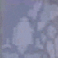
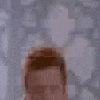
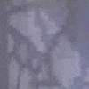
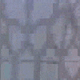
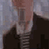
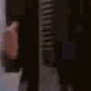
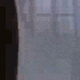

# 👋 Preved, я BulbaReaper

<h3 align="center"> Пытаюсь понять C++ и C# в университете в данный момент, дополнительно изучаю Python </h3>

# Если вы видите размытого Рика, то так и должно быть (честно)

<table align="center">
  <tr>
    <td></td>
    <td></td>
    <td></td>
  </tr>
  <tr>
    <td></td>
    <td></td>
    <td></td>
  </tr>
  <tr>
    <td></td>
    <td></td>
    <td></td>
  </tr>
</table>

  👉 <a href="https://www.youtube.com/watch?v=dQw4w9WgXcQ"><strong>Проектики</strong></a>

